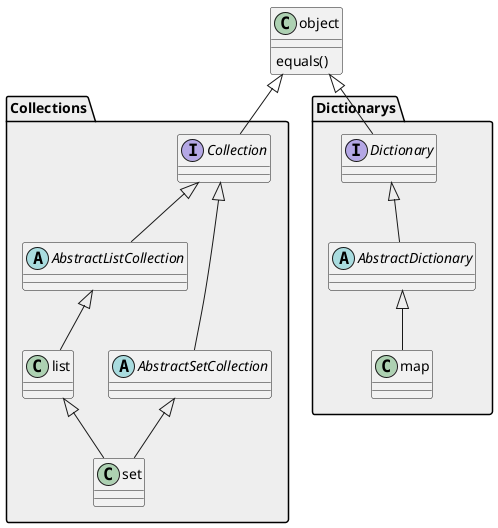

[HOME](/)

# Collie 编程语言官方文档

## 语言设计概述

Collie 是一种 AOT（Ahead Of Time; 先编译后运行）的编程语言，设计灵感来源于 C# 和 Java，并借鉴了其他编程语言（如：JavaScript, Python）的特性。该语言旨在降低编程难度，同时保持高效的运算能力，并提供良好的类型系统。

### 核心设计理念
- **null 安全**：Collie 语言基础类型不允许为 null，针对可能为 null 的场景，null 也是一个对象，实现了 object 的所有方法。使用 object? 问号语法显式声明，避免像 Java 语言那样需要对变量进行大量 null 判断。
- **隐式类型转换**：对于可能丢失精度的情况，Collie 不支持隐式的数字类型转换，需显式指定；对于不会丢失精度的情况，支持隐式数字类型转换。
- **数组与列表统一设计**：Collie 不区分数组 (Array) 与列表 (List)，统一使用 List。
- **消除歧义**：对于可能引起歧义的括号，必须添加。不支持逗号表达式，以免引起不必要的起义。
- **字符串遍历安全**：使用 UTF-16 编码格式作为默认编码，`character` 代表一个字符（无论一个字符占几个字节）。对于 BMP 范围外的字符（例如字符 `'𐍈'`），无需特殊处理。

---

## 数据类型

### 不可变数据类型

#### 基类型（Base Type）

基类型是所有类型的基础，所有类型都会继承自它。

|   类型   | 描述   |
| :------: | ------ |
| `object` | 基类型 |

##### 🏅基础方法

| 方法                                                         | 描述                                                         |
| ------------------------------------------------------------ | ------------------------------------------------------------ |
| object.clone(bool deep)                                      | 克隆对象，deep：指定是深拷贝（递归拷贝其内容）还是浅拷贝     |
| object.toString()                                            | 将对象转为字符串                                             |
| object.valueEquals(object anotherObject)                     | 比较两个对象的值是否相等                                     |
| object.referenceEquals(object anotherObject)                 | 比较两个对象是否是同一个对象。等价于：`object == anotherObject` |
| object.isNull()                                              | 判断一个对象是否是 null                                      |
| object.isProxy()                                             | 判断一个对象是否是代理对象                                   |
| object.getProxyTarget()<br />object.getProxyTarget(bool: deep) | 获取代理对象的原始对象。对于嵌套的 proxy 对象，如果 deep 为 true，则递归获取到最内层的 |


#### 空类型（None Type）

空类型也是一个对象。

|  类型  | 描述   |
| :----: | ------ |
| `none` | 空类型 |

> 注意：Collie 语言的空类型与其他语言有些差异， null 是一个特殊对象，也有其自身属性。

##### 🏅基础方法

| 方法                                      | 结果   | 描述             |
| ----------------------------------------- | ------ | ---------------- |
| null.toString()                           | "null" | 将对象转为字符串 |
| null.valueEquals(object? anotherNull)     | true   |                  |
| null.referenceEquals(object? anotherNull) | true   |                  |

##### 🏅语法示例

- 定义一个空：

```collie
none nullObject = null; // none 类型的所有对象都是 null(引用和值均相等), 所以这里也可以简写作：none nullObject;

if (nullObject.isNull()) { // 或 if (nullObject == null) {
	print("人生就是一场空");
}
```


#### 字符类型（Character Type）

|    类型     | 占用空间<br />（字节） | 描述                                                         |
| :---------: | :--------------------: | ------------------------------------------------------------ |
|   `char`    |         2 byte         | 单个字符。主要用作框架的底层逻辑实现等，**一般不建议直接使用 `char` 类型**。 |
| `character` |       2 / 4 byte       | 单字，对字符串中的每一项来说。1 个 `character` 为 1 个 `char` 或 1 个 **代理对**（具体细节可参考 [UTF-16 编码](ImplementationDetails/Unicode.md?id=utf-16) ） |
|  `string`   |        动态调整        | 字符串。等价于 `character[]`, `[character]`<br />也就是说，`character` 组成的一维数组，天然支持所有 `string` 的操作方式，你可完全将其当作 `string` 对象使用。 |

> 注意：
> <br>
> Collie 使用的 [Unicode 编码标准](ImplementationDetails/Unicode.md) 为 [**UTF-16 编码**](ImplementationDetails/Unicode.md?id=utf-16)。
> <br>在[不同语言和操作系统中，所采用的默认编码格式不同](ImplementationDetails/EncodingUsedByDifferentLanguagesOrOperatingSystems.md)。因此，`char` 类型占用空间不完全相同。

##### 🏅语法示例

- 定义一个字符 / 字符串：

```collie
char foo = 'm';
foo.toString() // result: "m"

string bar = "Hello world!"; // 或 string bar = ['h','e','l','l','o'];
bar.length // result: 12
```

- 字符与数字转换：

```collie
number('A') // result: 65
number('a') // result: 113
```

- 字符串拼接：

```collie
"he" + 'l' * 2 + char(111) // result: "hello";
```

- 字符数组与字符串互转：

```collie
char[] foo = "hello";
string bar = ['h','e','l','l','o'].toString();
[char] _foo = "he" + 'l' * 2 + char(111);

foo == bar // result: true
foo[2] == bar[3] == 'l' // result: true
```

- 重复字符 / 字符串：

```collie
"hello collie!" * 2 // result: "hello collie!hello collie!"
"hello collie!" * 0 // result: ""

'm' * 5             // result:  "mmmmm"
'm' * 0             // result:  ""
```

- 多行字符串：多行字符串使用 `"""` 包裹，起止符号需要对齐，其中的字符串内容，前面也需要填充空格对齐起止符号。

```collie
const foo = """
            Hello,
            collie!
            """
// result: "Hello,\ncollie!"

const bar =
    """
    Hello,
    collie!
    """
// result: "Hello,\ncollie!"

const withIndent =
    """
        Hello,
            world!
    """
// result: "    Hello,\n        world!"

// const text = """
// This is a wrong example!
// """
// ❌ 这是一个错误的示范，起止符号没有对齐

// const text = """
// This is a wrong example!
//              """
// ❌ 这是一个错误的示范，字符串内容没有与起止符号对齐
```

- 对字符串中的每一行添加前缀

```collie
"""
Hello,
Collie.
""".indent('    '); // 或 `.indent(' ' * 4)` 或 `.indent(4)` (4代表4个空格)
// result: "    Hello,\n    Collie."
```

- 移除字符串每一行的前导空格（及 Tab 制表符）

```collie
string str = "\nHello,\n    Collie\n\tLang.\n";
str.dedent(); // result: "\nHello,\nCollie\nLang.\n";
```

- 字符串子串：

```collie
// .subString(startIndex[, endIndex = string.length])
// 不传入 endIndex 或传入 -1, NaN 时
string str = "hello world"
str.subString(6); // "llo world"
str.subString(0, 2); // "he"
str[5:-1] // " world"
str[:] // "hello world"
```

- 移除字符串的前导、尾随空白字符

```collie
// 空白字符包含以下字符：空格; Tab 制表符
str.trimLeft();  // 移除字符串的前导空白字符
str.trimRight(); // 移除字符串的尾随空白字符
str.trim();      // 移除字符串的前导及尾随空白字符（等价于 `str.trimLeft().trimRight()`）
```

- 遍历字符串中的每个字符：

```collie
string str = "123𐍈";
for (character c : str) { // 等价于 for (character c : str.toCharacterArray()) {
	// c 依次为 '1' '2' '3' '𐍈'
}

// [不推荐] 对于底层实现，可以遍历其 char 数组
for (char char : str.toNotRecommendedCharArray()) {
	// char 依次为 '1' '2' '3' '\uD800' '\uDF48'
}
```

- 字符串插值

```collie
string name = "Lily";
number age = 18;
string sex = "girl";
string str = @"{name} is {age}-year-old {sex}." // result: "Lily is 18-year-old gril."
```


#### 数字类型（Numeric Type）

?> 数字类型为**不可变类型**。

##### 整数 & 小数类型（Number Type）

|   类型    | 占用空间<br />（字节） | 描述             |
| :-------: | :--------------------: | ---------------- |
| `number`  |          可变          | 可表示整数或小数 |
| `integer` |          可变          | 高精度整数       |
| `decimal` |          可变          | 高精度浮点数     |

###### 🏅语法示例

- 定义一个数字：

```collie
number num = 2025;
num.isInfinity() // result: false
num.isFinite() // result: true
num.isPositive() // result: true
num.isNegative() // result: false
num.isNaN() // result: false
num.isInteger() // result: true
num.isDecimal() // result: false
num.toString() // result: "2025"

number decimalNum = -.123456; // -0.123456
decimalNum.isInfinity() // result: false
decimalNum.isFinite() // result: true
decimalNum.isPositive() // result: false
decimalNum.isNegative() // result: true
num.isNaN() // result: false
num.isInteger() // result: false
num.isDecimal() // result: true
num.toString() // result: "-0.123456"

number anOtherDecimalNum = 2f; // 使用 f 结尾也可以表示浮点数，与 2.0, 2.00 等都等价

number positiveFinity = Infinity
positiveFinity.isInfinity() // result: true
positiveFinity.isFinite() // result: false
positiveFinity.isPositive() // result: true
positiveFinity.isNegative() // result: false
positiveFinity.isNaN() // result: false
positiveFinity.isInteger() // result: false
positiveFinity.isDecimal() // result: false
positiveFinity.toString() // result: "+Infinity"

number negativeFinity = -Infinity
negativeFinity.isInfinity() // result: true
negativeFinity.isFinite() // result: false
negativeFinity.isPositive() // result: false
negativeFinity.isNegative() // result: true
negativeFinity.isNaN() // result: false
negativeFinity.isInteger() // result: false
negativeFinity.isDecimal() // result: false
negativeFinity.toString() // result: "-Infinity"

number notANumber = NaN;
notANumber.isInfinity() // result: false
notANumber.isFinite() // result: false
notANumber.isPositive() // result: false
notANumber.isNegative() // result: false
notANumber.isNaN() // result: true
notANumber.isInteger() // result: false
notANumber.isDecimal() // result: false
negativeFinity.toString() // result: "NaN"
```

- 数字比较：

```collie
1 == 1.0 // result: true
```

- 数字转换为字符串：

```collie
12.toString(10) // "1"
12.toString(10) // "1"
12.00.toString(10) // "12.0"
NaN.toString() // "NaN"

// TODO 保留小数位数，保留几位有效数字
// TODO 科学计数法转字符串
```

- 字符串转数字：

```collie
"Infinity".toNumber() // result: Infinity
"+Infinity".toNumber() // result: Infinity
"-Infinity".toNumber() // result: -Infinity

"infinity".toNumber() // result: NaN
```

- 科学计数法

```collie
// TODO
```

- 四舍五入：

```collie
// TODO
```

- 取模：

```collie
-1 % 5 // result: 4
-1 % -5 // result: -1
1 % -5 // result: -4
```

?> **注意：**负数取模问题在不同编程语言中结果可能不同，例如 `-1 mod 5`，Java 语言中结果为 `-1`，Python 语言中结果为 `4`

- 整除：

```collie
Math.integerDivision(-1, 5) // result: -1
-1.integerDivision(5) // result: 0.2

-1 / 5 // result: -0.2
Math.division(-1, 5) // result: -0.2
```

- 加减乘除：

```collie
1.1 + 2 // result: 3.1

3 - 5.2 // -2.2

6 * 8 // result: 48

1 / 3 // result: 0.3333333333333333
2 / 3 // result: 0.6666666666666666
```

- 取绝对值：

```collie
-1.abs() // result: 1
Math.abs(-1) // result: 1
```

- 取整数部分

```collie
123.456.integerPart() // 123
123.456.decimalPart() // 0.456

-123.456.integerPart() // -123
-123.456.decimalPart() // -0.456
```

###### IEEE 754 标准 参考文献

- [754-2019 - IEEE Standard for Floating-Point Arithmetic](https://ieeexplore.ieee.org/document/8766229)
- [Lecture Notes on the Status of **IEEE Standard 754  for  Binary Floating-Point Arithmetic**](https://people.eecs.berkeley.edu/~wkahan/ieee754status/IEEE754.PDF)

##### [@Deprecated] 整数类型

?> **非负整数**和**非正整数**在类型前添加 `+`, `-` 区分。例如：`+short`, `-short`。

|  类型   | 占用空间<br />（字节） |              取值范围               | 最小值<br />object.MIN_VALUE                     | 最大值<br />object.MAX_VALUE                   | 描述     |
| :-----: | :--------------------: | :---------------------------------: | -----------------------------------------------: | ---------------------------------------------: | -------- |
| `short` |         2 byte         | [-2<sup>15</sup>, 2<sup>15</sup>-1] | -32,768<br />(-0x8000)                          | 32,767<br />(0x7FFF)                          | 16位整数 |
| `+short` |         2 byte         | [0, 2<sup>16</sup>-1] | 0<br />(0x0000)                          | 65,535<br />(0xFFFF)                    | 16位非负整数 |
| `-short` |         2 byte         | [-2<sup>16</sup>+1, 0] | -65,535<br />(-0xFFFF)         | -0<br />(-0x0000)              | 16位非正整数 |
|  `int`  |         4 byte         | [-2<sup>31</sup>, 2<sup>31</sup>-1] | -2,147,483,648<br />(-0x80000000)               | 2,147,483,647<br />(0x7FFFFFFF)               | 32位整数 |
|  `+int`  |         4 byte         | [0, 2<sup>32</sup>-1] | 0<br />(0x00000000)               | 4,294,967,295<br />(0xFFFFFFFF)  | 32位非负整数 |
|  `-int`  |         4 byte         | [-2<sup>32</sup>+1, 0] | -4,294,967,295<br />(-0xFFFFFFFF) | -0<br />(-0x00000000) | 32位非正整数 |
| `long`  |         8 byte         | [-2<sup>63</sup>, 2<sup>63</sup>-1] | -9,223,372,036,854,775,808<br />(-0x8000000000000000) | 9,223,372,036,854,775,807<br />(0x7FFFFFFFFFFFFFFF) | 64位整数 |
| `+long`  |         8 byte         | [0, 2<sup>64</sup>-1] | 0<br />(0x0000000000000000) | 18,446,744,073,709,551,615<br />(0xFFFFFFFFFFFFFFFF) | 64位非负整数 |
| `-long`  |         8 byte         | [-2<sup>64</sup>+1, 0] | -18,446,744,073,709,551,615<br />(-0xFFFFFFFFFFFFFFFF) | -0<br />(-0x0000000000000000) | 64位非正整数 |

###### 浮动小数类型

|   类型   | 占用空间<br />（字节） | 取值范围                                                     | 最小值<br />object.MIN_VALUE       | 最大值<br />object.MAX_VALUE                      | 描述         |
| :------: | :--------------------: | :----------------------------------------------------------: | ---------------------------------: | ------------------------------------------------: | ------------ |
| `float`  |         4 byte         | [2<sup>-149</sup>, (2-2<sup>-23</sup>)&middot;2<sup>127</sup>] | 1.4e-45<br />(0x1.0p-126)         | 3.4028235e+38<br />(0x1.FFFFFE0000000p+127)      | 32位浮动小数 |
| `+float`  |         4 byte         | 需要确认 | 需要确认           | 需要确认        | 32位非负浮动小数 |
| `-float`  |         4 byte         | 需要确认 | 需要确认           | 需要确认                                          | 32位非正浮动小数 |
| `double` |         8 byte         | [2<sup>-1074</sup>, (2-2<sup>-52</sup>)&middot;2<sup>1023</sup>] | 4.9e-324<br />(0x0.0000000000001p-1022) | 1.7976931348623157e+308<br />(0x1.FFFFFFFFFFFFFp+1023) | 64位浮动小数 |
| `+double` |         8 byte         | 需要确认 | 需要确认                           | 需要确认                                          | 64位非负浮动小数 |
| `-double` |         8 byte         | 需要确认 | 需要确认                           | 需要确认                                          | 64位非正浮动小数 |

###### 通用数字类型

| 类型     | 描述                                                         |
| -------- | ------------------------------------------------------------ |
| `number` | 支持保存整数和小数，对于执行效率要求不高的场景，可使用该类型减少心智负担 |
| `integer` | 高精度整数（能够精确表示任意大小的整数） |
| `decimal` | 高精度浮点数（能够精确表示任意位小数），浮点数运算输出17位长度的结果，但只有15个数字是准确的 |


#### 布尔类型（Boolean Type）

|   类型    | 描述                                                        |
| :-------: | ----------------------------------------------------------- |
|  `bool`   | 布尔类型，值为 `true` 或 `false`，默认值为 `false`          |
| `tribool` | 三元类型，值为 `true`，`false` 或 `unset`，默认值为 `unset` |

!> *TODO 需要确认是否设计默认值（看是否可以实现类似 Java 那样的不初始化就不允许使用）*

##### 布尔类型（Boolean Type）

###### 🏅语法示例

- 定义布尔类型：

```collie
bool a = true;
bool b = !a; // result: false

a == false // result: false
a == true  // result: true
```

- 多目运算符及其简化形式：

```collie
bool a;
// 此处省略给 a 变量赋值的相关逻辑

// 简化形式
a ? 1 : 2
// when a equals true,  result: 1
// when a equals false, result: 2

// 原始写法
a =? true: 1, false: 2
// when a equals true,  result: 1
// when a equals false, result: 2

a ?= false: 1, 2
// when a equals false,       result: 1
// otherwise (a equals true), result: 2
```

##### 三态布尔类型（Tri-State Boolean Type）

三态布尔类型由布尔类型扩展而来，添加了 `unset` 选项。`unset` 取反仍为 `unset`，其他特性均与布尔类型一致。

###### 🏅语法示例

- 定义三态布尔类型：

```collie
tribool a = unset;
```

- 布尔类型、三态布尔类型的比较：

```collie
tribool a, bool b = unset, false;
a == b  // result: false
a == !b // result: false

unset == true   // result: false
unset == false  // result: false
unset == !unset // result: true

!true  // result: false
!false // result: true
!unset // result: unset
```

- 多目运算符：

```collie
tribool a;
// 此处省略给 a 变量赋值的相关逻辑

a =? unset: 1, true: 2, false: 3
// when a equals unset, result: 1
// when a equals true,  result: 2
// when a equals false, result: 3

a ?= unset, true: 2, false: 3
// when a equals true or unset,  result: 2
// when a equals false,          result: 3

a ?= unset, true: 1, 2
// when a equals unset or true, result: 1
// otherwise (a equals false),  result: 2

a ?= 2, unset: 1
// when a equals unset,                result: 1
// otherwise (a equals false or true), result: 2

// a ?= unset, true: 2
// ❌ 不允许的写法：缺少 false 分支

/* 如果表达式较长，推荐的格式如下
// 注意，value1, value3 如果都与 hereIsAVeryLongParamName 相等，则会返回第一个匹配上的条件对应结果 (expression 1)
object a = hereIsAVeryLongParamName ?=
                value1, value2: {
                    expression 1
                },
                value3: {
                    expression 2
                },
                expression 3
 */
```

- 多目运算符简化形式：

```collie
tribool a;
// 此处省略给 a 变量赋值的相关逻辑

a ? 1 : 2 : 3
// when a equals true,  result: 1
// when a equals false, result: 2
// when a equals unset, result: 3

a ? 1 : 2
// when a equals true,           result: 1
// when a equals false or unset, result: 2

/* 如果表达式较长，推荐的格式如下
object a = hereIsAVeryLongParamName
               ? expression 1
               : expression 2
               [: expression 3]
 */
```


#### 位类型（Bitwise Type）

##### 位类型

| 类型   | 占用空间 | 取值范围 | 最小值<br/>object.MIN_VALUE | 最大值<br />object.MAX_VALUE | 描述                  |
| :----: | :-------------------: | :-------------------: | --------------------: | --------------------: | --------------------- |
| `bit`  | 1 bit | [0, 2<sup>1</sup>-1] | 0<br />(0b0) | 1<br />（0b1) | 位   |
| `byte` | 1 byte (8 bit) | [0, 2<sup>8</sup>-1] | 0<br />(0b0000 0000)<br />（0x00) | 255<br />(0b1111 1111)<br />(0xFF) | 字节。8位无符号整数 |
| `word` | 2 byte (16 bit) | [0, 2<sup>16</sup>-1] | 0<br />(0x00 00) | 65,535<br />(0xFF FF) | 单字。16位无符号整数 |
| `dword` | 4 byte (32 bit) | [0, 2<sup>32</sup>-1] | 0<br />(0x00 00 00 00) | 4,294,967,295<br />(0xFF FF FF FF) | 双字。32位无符号整数 |

?> collie 语言默认采用**大端序（Big-Endian）**。在这种存储方式中，数据的**高位字节存于低地址，低位字节存于高地址**。
<br>
以 16 位 word `0x1234` 为例，在大端序存储时，高位字节 `0x12` 存于内存的低地址，低位字节 `0x34` 存于内存的高地址。
<br>
就好像按照从左到右（高位在前）的顺序存储数据，这符合人类正常的思维习惯，先看到高位部分。
<br>
从数据角度看，32 位整数 `0x12345678` 在大端序下，字节序列为 `0x12` `0x34` `0x56` `0x78` (最高位字节 → 最低位字节)。

###### 位操作符

- 按位与：`&`
- 按位或：`|`
- 按位异或：`^`
- 按位取反：`~`
- 左移：`<<`
- 右移：`>>`

###### 🏅位操作示例

- 位运算

```collie
byte a = 0b10101010;
byte b = 0b11001100;

byte c = a & b;  // result: 0b10001000
byte d = a | b;  // result: 0b11101110
byte e = a ^ b;  // result: 0b01100110
byte f = ~a;     // result: 0b01010101

byte g = a << 2; // result: 0b10101000
byte h = a >> 2; // result: 0b00101010
```

- 位(bit)基础操作

```collie
// 使用字面量
bit bit1 = 0b0; // 或者直接写作 0
bit bit2 = 0b1; // 或者直接写作 1
```

- 字节(byte)基础操作

```collie
// 使用字面量
byte byteVal = 0b10101010;                   // result: 0b10101010

// 8 个 bit 组成 byte
bit[] bits = [1, 0, 1, 0, 1, 0, 1, 0];
byte byteVal1 = byte(bits);                    // result: 0b10101010
byte byteVal2 = byte(1, 0, 1, 0, 1, 0, 1, 0); // result: 0b10101010

// 从 byte 中提取 bit
bit firstBit = byteVal.getHighBit(); // 或 byteVal.getBitByIndex(0);  // 获取最高位 result: 0b1
bit lastBit = byteVal.getLowBit();   // 或 byteVal.getBitByIndex(-1); // 获取最低位 result: 0b0
bit[] allBits = byteVal.toBits();  // 转换为 bit 数组 result: [0b1, 0b0, 0b1, 0b0, 0b1, 0b0, 0b1, 0b0]

// 将 bit[] 转为 byte
byte byteFormBits = allBits.toBytes(); // result: 0b10101010
// ⚠ 注意元素个数需要正确
```

- 单字(word)基础操作

```collie
// 使用字面量
word wordVal = 0xFF00;          // result: 0xFF00

// 2 个 byte 组成 word
byte high, low = 0xFF, 0x00;
word wordVal1 = word(high, low);                                      // result: 0xFF00

// 16 个 bit 组成 word
byte byteVal2 = word(1, 1, 1, 1, 1, 1, 1, 1, 0, 0, 0, 0, 0, 0, 0, 0); // result: 0xFF00

// 从 word 中提取 byte
byte highByte = wordVal.getHighByte();  // 获取高字节 result: 0xFF
byte lowByte = wordVal.getLowByte();    // 获取低字节 result: 0x00
byte[] bytes = wordVal.toBytes();  // 转换为 byte 数组

// 从 word 中提取 bit
bit firstBit = byteVal[0];   // 获取最高位
bit lastBit = byteVal[15];    // 获取最低位
bit[] allBits = wordVal.toBits();  // 转换为 bit 数组
```

- 双字(dword)基础操作

```collie
// 2 个 word 组成 dword
word w1 = 0xFF00
word w0 = 0x00FF
dword dwordVal1 = dword(w1, w0);  // result: 0xFF00FF00
// 4 个 byte 组成 dword
byte b3 = 0xFF;
byte b2 = 0x00;
byte b1 = 0xFF;
byte b0 = 0x00;
dword dwordVal2 = dword(b3, b2, b1, b0);  // result: 0xFF00FF00
// 使用字面量
dword dwordVal = 0xFF00FF00;

// 从 dword 中提取 word
byte highByte = dwordVal.high;  // 获取高字节
byte lowByte = dwordVal.low;    // 获取低字节
word[] words = dwordVal.toWords();  // 转换为 word 数组

// 从 dword 中提取 byte
byte[] allBits = dwordVal.toBytes();  // 转换为 byte 数组

// 从 dword 中提取 bit
byte firstByte = dwordVal[0];    // 获取最高位
byte lastByte = dwordVal[31];    // 获取最低位
bit[] allBits = dwordVal.toBits();  // 转换为 bit 数组
```

- 类型转换

```collie
byte byteValue = 255;
word wordValue = word(byteValue);      // 隐式转换：0x00FF
dword dwordValue = dword(wordValue);   // 隐式转换：0x0000FF00
```

- 位提取

```collie
bit getBit(byte value, int position) {  // position: 0-7
    return (value >> position) & 1;
}
```

- 位设置

```collie
byte setBit(byte value, int position, bit newBit) {  // position: 0-7
    if (newBit == 1) {
        return value | (1 << position);
    } else {
        return value & ~(1 << position);
    }
}
```


##### 缓冲区 / 字节数组类型（TODO）

?> 需要确认下 buffer 叫做缓冲区是否合适

|   类型   | 占用空间 （字节） | 描述                                                         |
| :------: | :---------------: | ------------------------------------------------------------ |
|  `byte`  |      1 byte       | 1 字节                                                       |
| `buffer` |      不固定       | 缓冲区 / 字节数组。等价于 `byte[]`, `[byte]` <br />也就是说，`byte` 组成的一维数组，天然支持所有 `buffer` 的操作方式，你可完全将其当作 `buffer` 对象使用。 |


### 可变数据类型

#### 容器类型（Container Type）

数据容器支持动态添加、删除、修改、获取元素。



##### 数组与集合类型

|      类型      | 描述                           |
| :------------: | ------------------------------ |
| `list[object]` | 数组类型。无序的不重复元素序列 |
| `set[object]`  | 集合类型。无序的不重复元素序列 |

###### 🏅基础方法

| 方法                                                      | 描述                                                         |
| --------------------------------------------------------- | ------------------------------------------------------------ |
| collection.toString()                                     | 将数组 / 集合对象转为字符串。以 `','` 连接所有元素。对每个元素都会调用其 `.toString()` 方法 |
| collection.join(string\|character str)                    |                                                              |
| collection.valueEquals(collection? anotherCollection)     | 比较两个数组 / 集合对象元素个数及每个元素的值是否相等。对每个元素都会调用其 `.valueEquals()` 方法 |
| collection.referenceEquals(collection? anotherCollection) | 比较两个数组 / 集合对象元素个数及每个元素的引用是否相等。对每个元素都会调用其 `.referenceEquals()` 方法 |

###### 🏅语法示例

- 定义

```collie
// 使用 new 关键字初始化
list[number] = new list(1, 2, 3, 4, 5);

// 字面量初始化
var list1 = list(1, 2, 3, 4); // var 自动推断类型为 list[number]
var list2 = [1, 2, 3, 4]; // 也可以直接使用 `[]`
```

- 数组拼接：

```collie
var list1 = list(1, 2, 3, 4);
var list2 = list(5, 6, 7, 8);

[number] list;
list = list1 + list2; // list 为新数组，不会改变原数组 result: [1, 2, 3, 4, 5, 6, 7, 8]
list = [...list1, ...list2]; // 同上
list = [...list1].concat(list2); // 同上

list = list1.concat(list2); // 将 list2 的元素全部添加到 list1 中，并且返回。此时 list list1 指向统一数组，list2 不变。
```

- 多维数组：

```collie
// 二维数组
list[[number]] numList_2 = [[1, 2], [3, 4], [5, 6]];

// 三维数组
list[[[number]]] numList_3 = [[[1, 2], [3, 4]], [[5, 6], [7, 8]]];

// 数组拍平
list[number] flatNumList = numList_3.flat(); // 拍平数组。返回新数组，不改变原数组 result: [1, 2, 3, 4, 5, 6, 7, 8]
```

?> *TODO 多维数组是否可以写作：`number[n]`？（n为一个 integer）*

- 数组、集合互转：

```collie
// 数组转集合
set[[number]] numSet = numList_2.toSet(referenceEquals: true);
// 注意，referenceEquals 为 true 时按照引用去重，为 false 时将对比数组每一项其中的值是否相等。默认为 true

// 集合转数组
list[[number]] numList = numSet.toList();
// 如果需要排序，可以使用 `numSet.toList().sortBy()`
```

- 多类型数组：

```collie
list[number | [number]] list1 = [1, [2, 3], 4];
list[string | [number]] list2 = ["1", [2, 3], "4"];

// 注意：多类型的数组遍历时只能使用其公有方法
for (item : list2) {
	// 因为 string 和 [number] 都支持获取长度，所以这里 ✅ 可以使用
	integer len = item.length;
	// 因为 string 和 [number] 都支持 + 运算符，但是 + 右侧所需类型不同，所以这里 ❌ 不能使用
	// 因为 string 和 [number] 都支持 * 运算符，所以这里 ✅ 可以使用
	item *= 2;
}
// 此时 list2 的值为: ["11", [2, 3, 2, 3], "44"];
```


##### 字典类型

|         类型          | 描述                     |
| :-------------------: | ------------------------ |
| `map[string: number]` | 字典类型。支持键值对存储 |

###### 🏅语法示例

```collie
var set = set(1, 2, 3);       // var 自动推断类型为 set[number]
var map = map({ apple: 5, banana: 6 }); // var 自动推断类型为 map[string: number]
```
